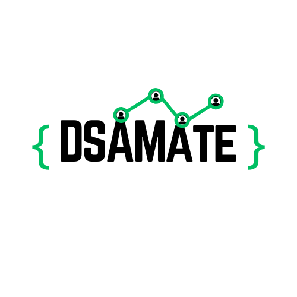

## 🔰 Logo Explanation

The **DSAMate** logo visually captures the essence of the platform—**collaborative learning in Data Structures and Algorithms (DSA)**.

- **Bold "DSAMATE" Text**: Represents the solid foundation of DSA learning with confidence and clarity.
- **Green Curly Braces `{ }`**: Symbolize code blocks, representing the project's programming focus.
- **Connected Graph Line with Nodes**: Depicts a graph structure from DSA, and symbolizes progress, connectivity, and problem-solving steps.
- **User Icons on Nodes**: Reflect community-driven learning—you're not alone; DSAMate is about growing together.

The logo merges **tech**, **community**, and **learning** into one visual identity for DSAMate.
