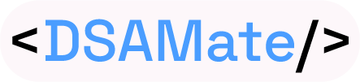
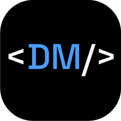

## DSAMate - Logo submission

**Designed by**: [@aigle-levant](https://github.com/aigle-levant)

**Design goals**: The logo will meet the following requirements:

- Accessible and user-friendly, be it in desktop or mobile.
- Reflects simplicity and clean design.
- Fits the vibe of DSAMate.

## Preview

### Full-size

### Favicons

## Deliverables provided

For the logo, I've provided light / dark variants of both the full-size logo as well as the favicon versions.

I've also added the Illustrator source file for further reference.

## Colour scheme

Based on the website's design, I've chosen the following colours.

#4497FF (Dodger Blue) - Primary colour + promotes trustworthiness.

#000 (Black) / #FDF7FA (Snow) - Background for dark / light modes. Snow was especially chosen for ensuring maximum accessibility.

## Usage

This logo can be used as follows:

- Favicon logo can be used for mobile navbars, browser tab icon, GitHub repo avatar, app icon, etc.
- The full-size logo can be used for desktop navbars, social media banners, about pages and footers, etc.
